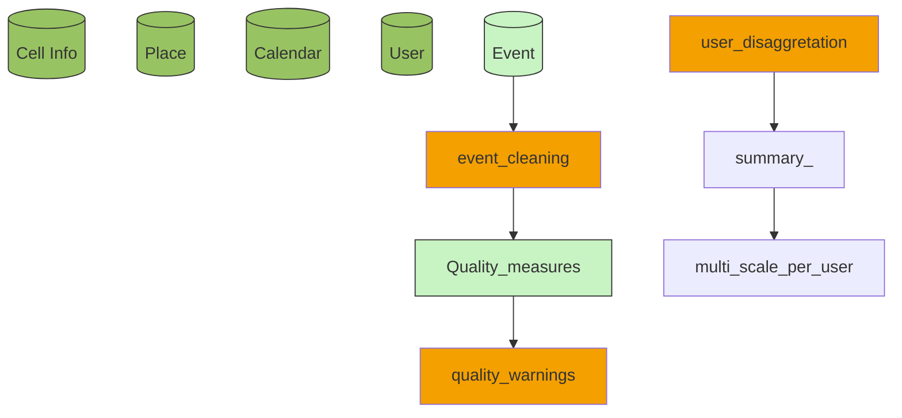
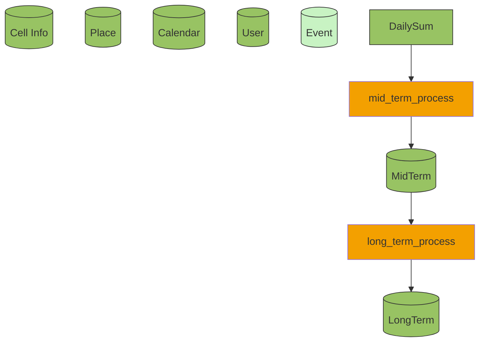

IStat Objects

```mermaid
flowchart TD
classDef data fill:#033d59,stroke-width:1px, color:#333333;
classDef process fill:#f3a000,stroke-width:1px,color:#333333;
classDef db fill:#c8f3c3,stroke:#333333,color:#333333;
classDef db_rest fill:#98c363,stroke:#333333,color:#333333;


Cell[("Cell Info")]:::db_rest
Place[("Place")]:::db_rest
Calendar[("Calendar")]:::db_rest
User[("User")]:::db_rest
Event[("Event")]:::db

Quality_measures:::db

event_cleaning:::process
quality_warnings:::process
user_disaggretation:::process

Event --> event_cleaning
event_cleaning --> Quality_measures --> quality_warnings
user_disaggretation --> summary_ --> multi_scale_per_user
```

Multiscale

```mermaid
flowchart TD
classDef data fill:#033d59,stroke-width:1px, color:#333333;
classDef process fill:#f3a000,stroke-width:1px,color:#333333;
classDef db fill:#c8f3c3,stroke:#333333,color:#333333;
classDef db_rest fill:#98c363,stroke:#333333,color:#333333;


Cell[("Cell Info")]:::db_rest
Place[("Place")]:::db_rest
Calendar[("Calendar")]:::db_rest
User[("User")]:::db_rest
Event[("Event")]:::db

DailySum:::db_rest
midterm_sum[("MidTerm")]:::db_rest
longterm_sum[("LongTerm")]:::db_rest

mid_term_process:::process
long_term_process:::process

DailySum --> mid_term_process
mid_term_process --> midterm_sum
midterm_sum --> long_term_process
long_term_process --> longterm_sum
```
