# Pipeline

## General

### Events: Import and clean up high frequency events

Can also be roaming SMS

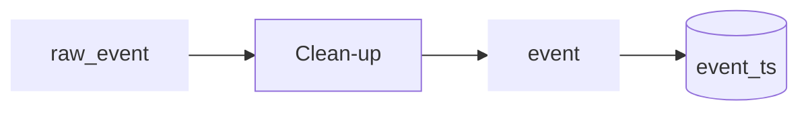

### Stays: Turn high frequency data/events into stays

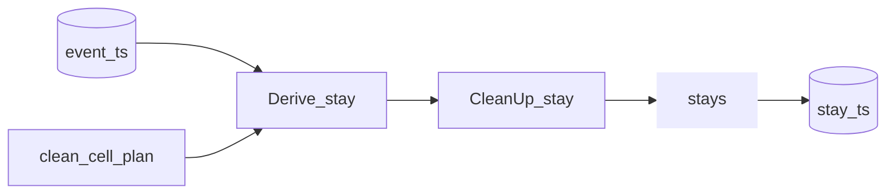

### Anchors

Classify stays and clean up stays into "meaning full" anchors (home/work etc.)

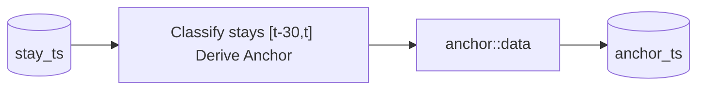

### Device classification
Roaming + Human/machine

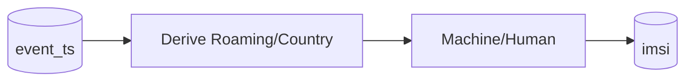

## Other data

### Import cell plan

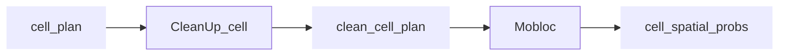
An alternative for the last step would be to use data from the MNO such as best service maps to derive the `cell_spatial_probs`
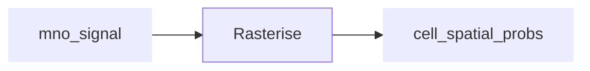

### Import geodata

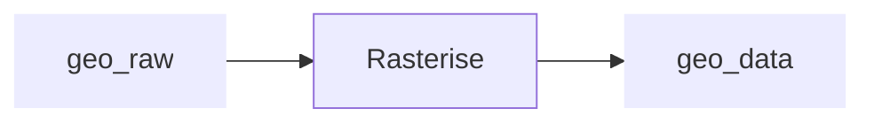

## Use-Cases

### Use Case: Spatial current population

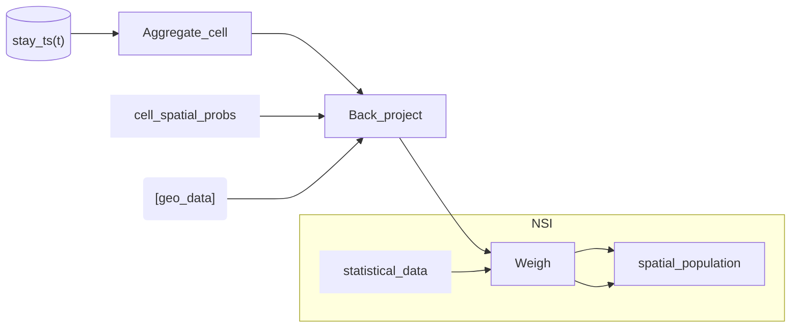

### Use Case: Spatial current population by home location

Derive home location
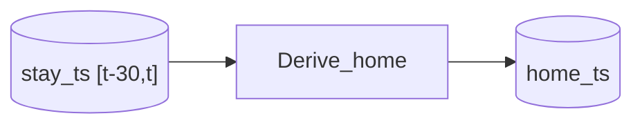

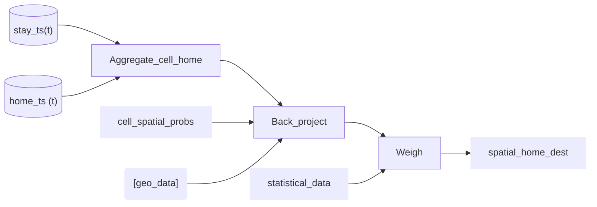

### Use Case: spatial estimation of foreign tourist

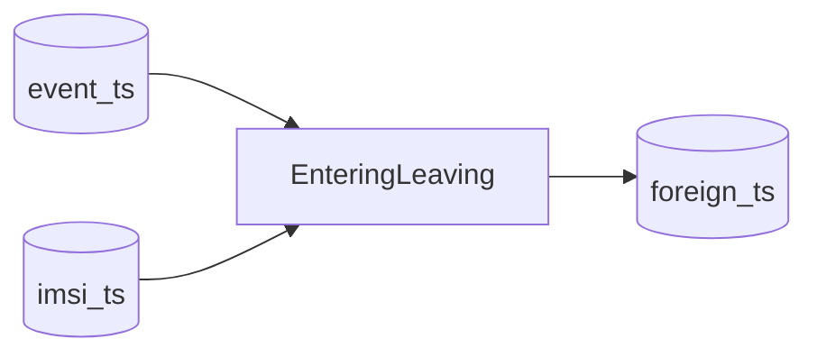

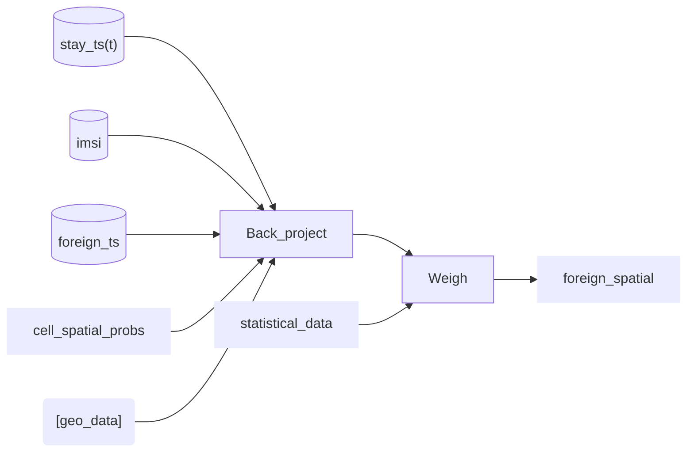

