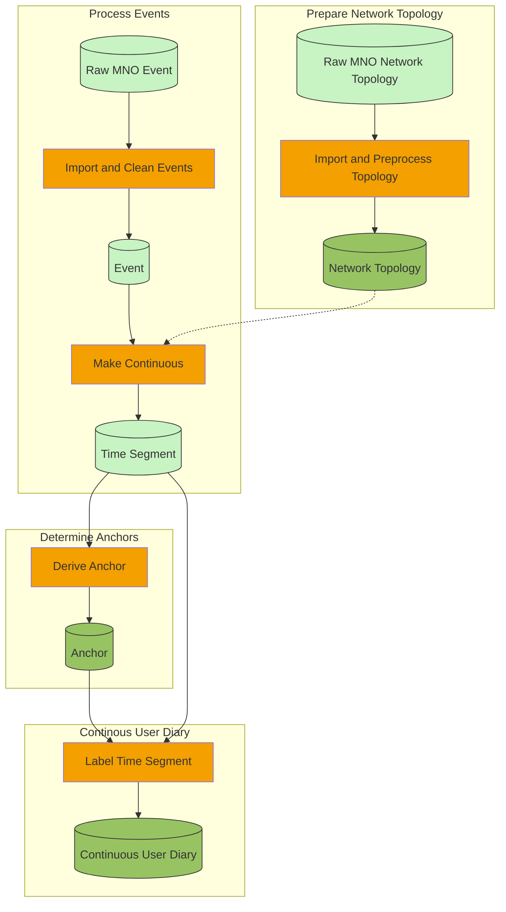
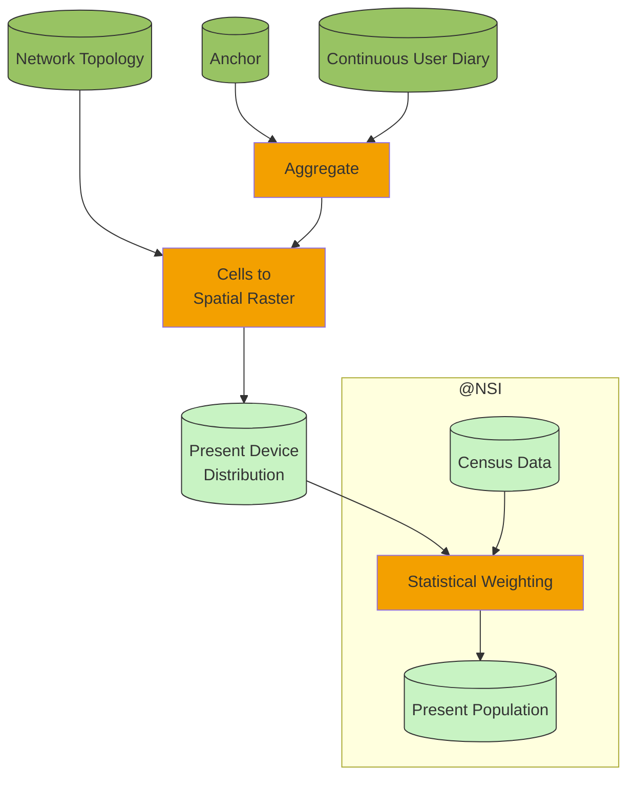

## Overview of the general pipeline

The schema below shows an overview of the general pipeline. The cylinder shaped objects are the different object types. The rectangles are the processes transforming the object types. Note that in practice a transformation between two object types can consist of multiple subtransformations. The goal of this schema is to give the outline of the process. The darker green data types are the general components that can be used by the different use-cases. 

### Main concepts in the general pipeline

`Event`
: The main information (after preprocessing) obtained from the MNO. Contains discrete events. The main information in the events are the Device, Cell (this can also be a GPS coordinate) and Time. 

`Time Segment`
: Combines several `Events` of a Device into continuous time segments. In principle time segments are continuous (there are no gaps between the `Time Segments`). However, it is possible that for certain longer time periodes without events no `Time Segment` is defined. 
: Contains the seperate `Events`. Therefore, no information present in the `Events` is lost. 
: Can contain `Events` that took place at different Cell.

`Anchor`
: A combination of Cell that is meaningfull for a Device. An `Anchor` is, therefore, labelled.
: For example, the home location of a Device can be defined using a number of Cells (possibly weighted).
: A device can have multiple `Anchors` (e.g. 'Home', 'Work')
: Has a begin time and end time for which the `Anchor` is valid.

`Continuous User Diary`
: In the `Continuous User Diary` some of the `Time Segments` are labelled. 
: For example, some of the `Time Segments` could be labelled as 'At Home'. 

`Network topology`
: Contains information for each Cell in the network.
: Contains for each Cell a raster map with the probability of connecting to the Cell given the location.
: Each record had a begin and end time indicating when the information is valid.

Note that the `Event`, `Time Segment`, `Anchor` and `Continuous User Diary` do not contain geographic information. All geographic information is contained in the Cell that are part of the relevent object type. There are a couple of reasons for this. First, the location of a device is not known in more detail than the combination of Cell. Second, the transformation from Cell to geographic location depends in part on the specific use case. For some use cases this transformation is simple (count devices in Rome) while for other use cases a more complex transformation is needed (number of devices taking the train). Third, some of the methods for transforming the Cells to geographic location, such as the ML-EM estimator, need to combine the information from multiple devices at the same time. Therefore it is not possible to generate a geographic location per Device.

## Use Case: Present population in space and time

