# Pipeline

## General

### Events: Import and clean up high frequency events

Can also be roaming SMS

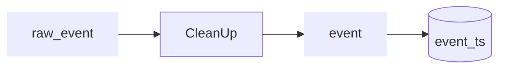

|deviceid  |time   |cell |
|---------:|:------|:----|
|1         |t1     |A    |
|1         |t2     |A    |
|1         |t3     |B    |
|1         |t4     |A    |
|1         |t5     |C    |
|1         |t6     |D    |
|1         |t7     |E    |
|1         |t9     |F    |
|1         |t10    |E    |
|1         |t11    |D    |
|1         |t12    |G    |
|1         |t13    |A    |
|1         |t14    |B    |

### Stays: Turn high frequency data/events into stays

Stays combine multiple events where a device 'stayed' in one location. In the most simple case these are just periods where a device had events on only one cell. For more complex use cases it could be possible to combine events from different cells into one stay when these cells cover the same location. Note that not alle events have to be classified into stays. Events can remain on their own.

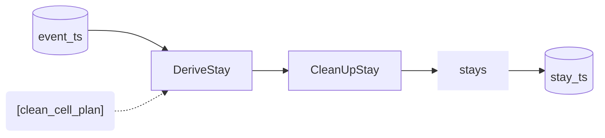

Possible output format could be (continueing the previous example):

|deviceid  |timebegin |timeend |cell |stayid |
|---------:|:---------|:-------|:----|------:|
|1         |t1        |t2      |A    |1      |
|1         |t3        |t3      |B    |1      |
|1         |t4        |t4      |A    |1      |
|1         |t5        |t5      |C    |       |
|1         |t6        |t6      |D    |       |
|1         |t7        |t7      |E    |2      |
|1         |t9        |t9      |F    |2      |
|1         |t10       |t10     |E    |2      |
|1         |t11       |t11     |D    |       |
|1         |t12       |t12     |G    |       |
|1         |t13       |t13     |A    |3      |
|1         |t14       |t14     |B    |3      |

### Anchors

Anchors are meaningfull locations for a device. One important example is 'home' which is the home location of a device. The anchors are relatively constant in time, but they can change in time. For example, persons can move to another address. They are also device dependent. In order to determine anchors for a device a longer period of data is required. It depends on the use cased the pipeline has to serve, which types of anchors are relevant. For most use cases the 'home' anchor will be relevant.

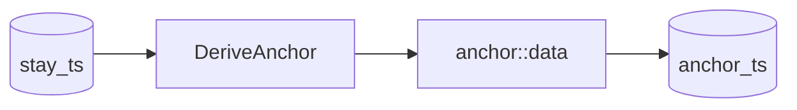

|deviceid  |timebegin  |timeend   |cell |anchor    |
|---------:|:----------|:---------|:----|:---------|
|1         |t1         |t20       |A    |home      |
|1         |t1         |t20       |B    |home      |
|1         |t20        |t40       |K    |home      |
|1         |t1         |t30       |E    |workplace |
|1         |t1         |t30       |F    |workplace |

### Classify stays
Add labels to some of the stays. 

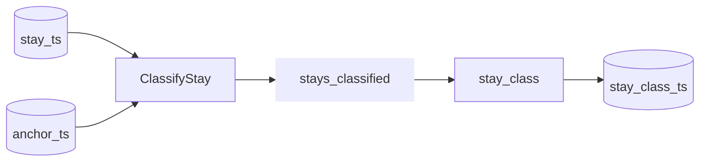

|deviceid  |timebegin |timeend |cell |stayid |class |
|---------:|:---------|:-------|:----|------:|:-----|
|1         |t1        |t2      |A    |1      |home  |
|1         |t3        |t3      |B    |1      |home  |
|1         |t4        |t4      |A    |1      |home  |
|1         |t5        |t5      |C    |       |      |
|1         |t6        |t6      |D    |       |      |
|1         |t7        |t7      |E    |2      |work  |
|1         |t9        |t9      |F    |2      |work  |
|1         |t10       |t10     |E    |2      |work  |
|1         |t11       |t11     |D    |       |      |
|1         |t12       |t12     |G    |       |      |
|1         |t13       |t13     |A    |3      |home  |
|1         |t14       |t14     |B    |3      |home  |

### Device classification
Roaming + Human/machine

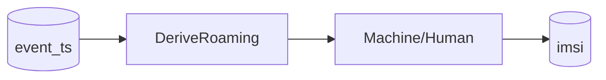

## Other data

### Import cell plan

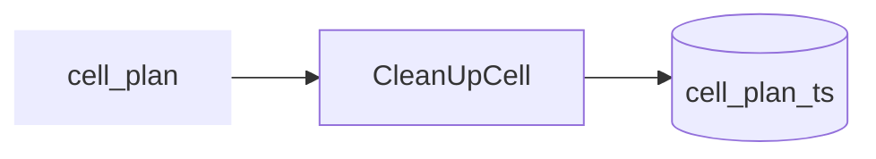

### Determine signal strength

The ideal scenario is that signal strength data are delivered from the MNO 

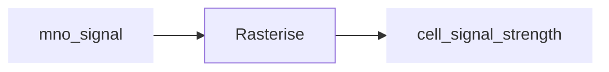

Alternatively, signal strength can be modeled from the cell plan data, and/or the (n)-Best Server Maps:

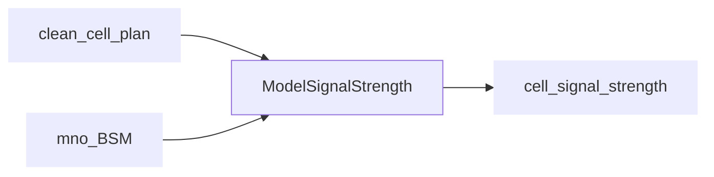

One of the methods that can be used for ModelSignalStrength is the mobloc method (and corresponding R package). Best Server Maps can be used to validate the output (and set the model parameters).

### Model probability of connection

This step is needed to translate the signal strength values to the 'quality' of connection. In the mobloc method, this is called signal dominance.

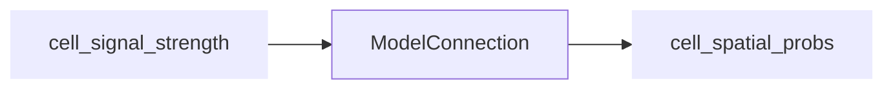

### Import geodata

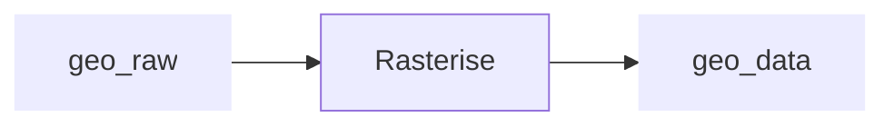

## Use-Cases

### Use Case: Spatial current population

### Use Case: Spatial current population by home location

Derive home location
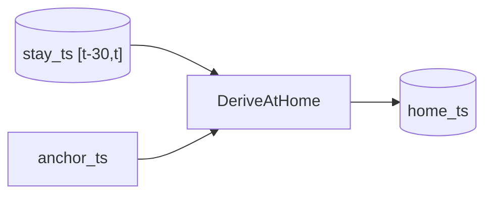

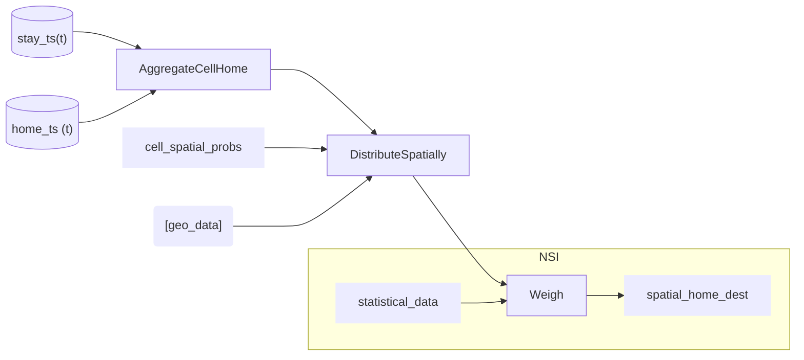

### Use Case: spatial estimation of foreign tourist

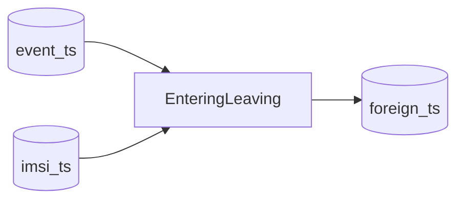

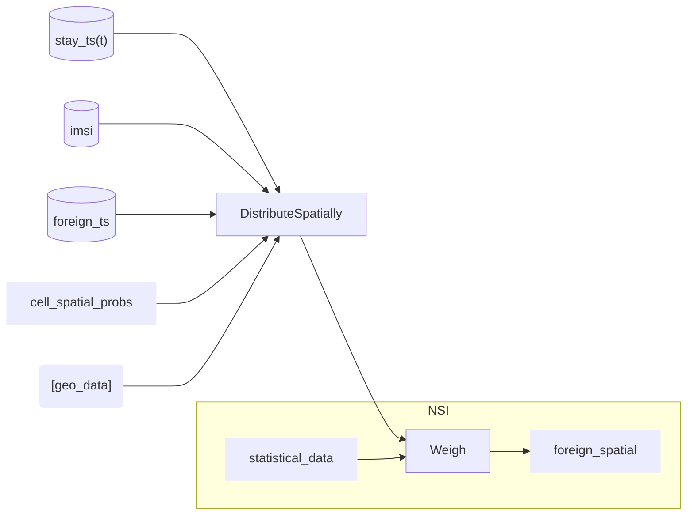

