# Pipeline

## General

### Events: Import and clean up high frequency events

Can also be roaming SMS

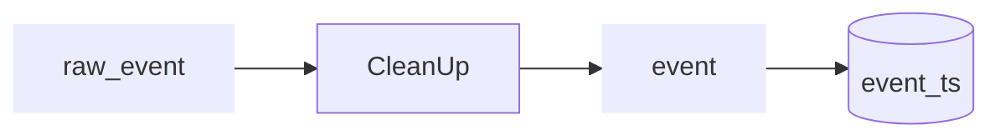

|deviceid  |time   |antenna|
|---------:|:------|:------|
|1         |t1     |A      |
|1         |t2     |A      |
|1         |t3     |B      |
|1         |t4     |A      |
|1         |t5     |C      |
|1         |t6     |D      |
|1         |t7     |E      |
|1         |t9     |F      |
|1         |t10    |E      |
|1         |t11    |D      |
|1         |t12    |G      |
|1         |t13    |A      |
|1         |t14    |B      |

### Stays: Turn high frequency data/events into stays

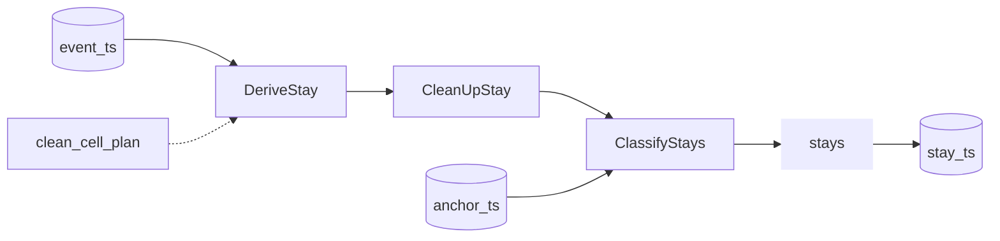

### Anchors

Classify stays and clean up stays into "meaning full" anchors (home/work etc.)

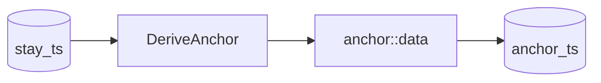

### Device classification
Roaming + Human/machine

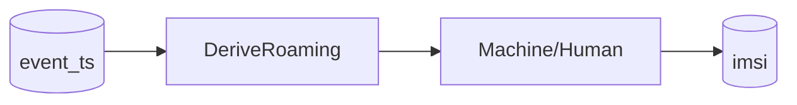

## Other data

### Import cell plan

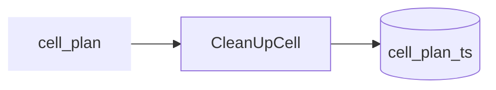

### Determine signal strength

The ideal scenario is that signal strength data are delivered from the MNO 

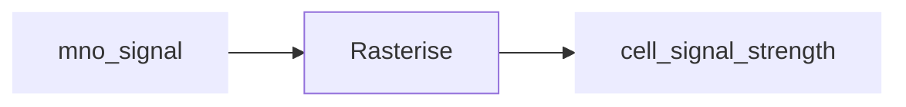

Alternatively, signal strength can be modeled from the cell plan data, and/or the (n)-Best Server Maps:

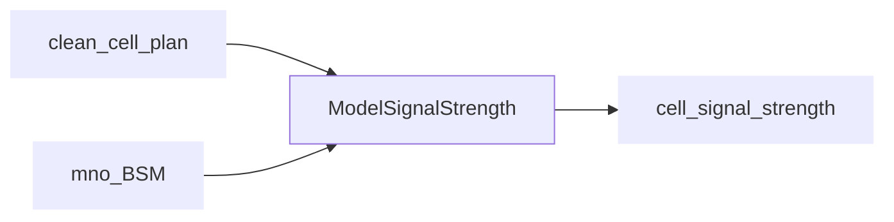

One of the methods that can be used for ModelSignalStrength is the mobloc method (and corresponding R package). Best Server Maps can be used to validate the output (and set the model parameters).

### Model probability of connection

This step is needed to translate the signal strength values to the 'quality' of connection. In the mobloc method, this is called signal dominance.

### Import geodata

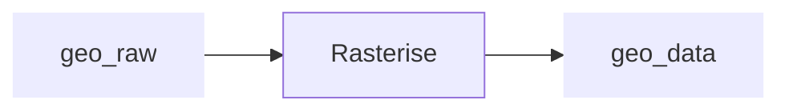

## Use-Cases

### Use Case: Spatial current population

### Use Case: Spatial current population by home location

Derive home location
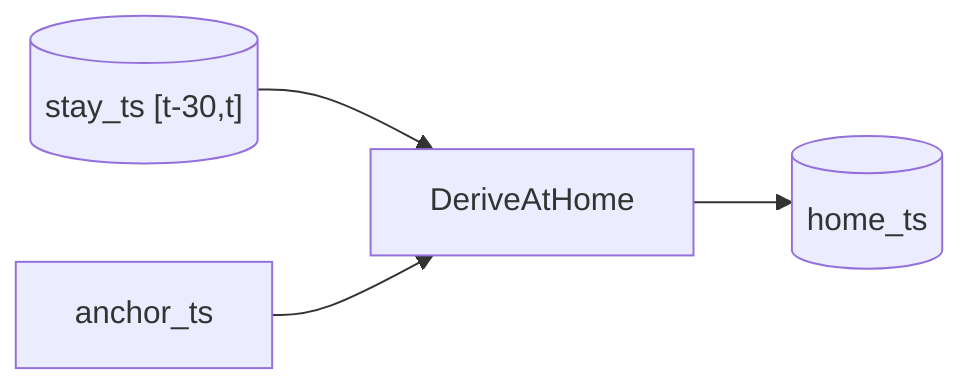

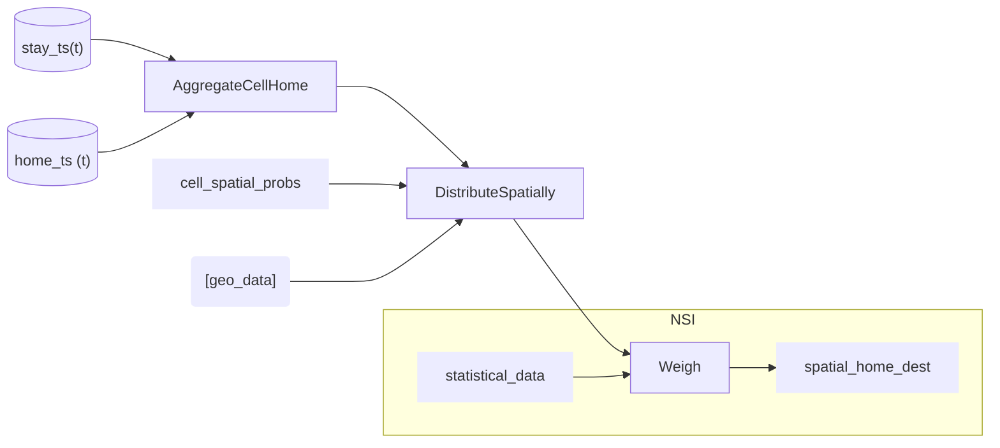

### Use Case: spatial estimation of foreign tourist

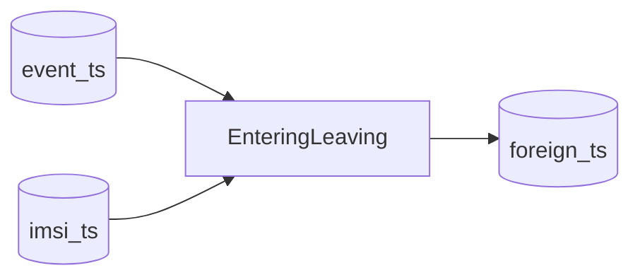

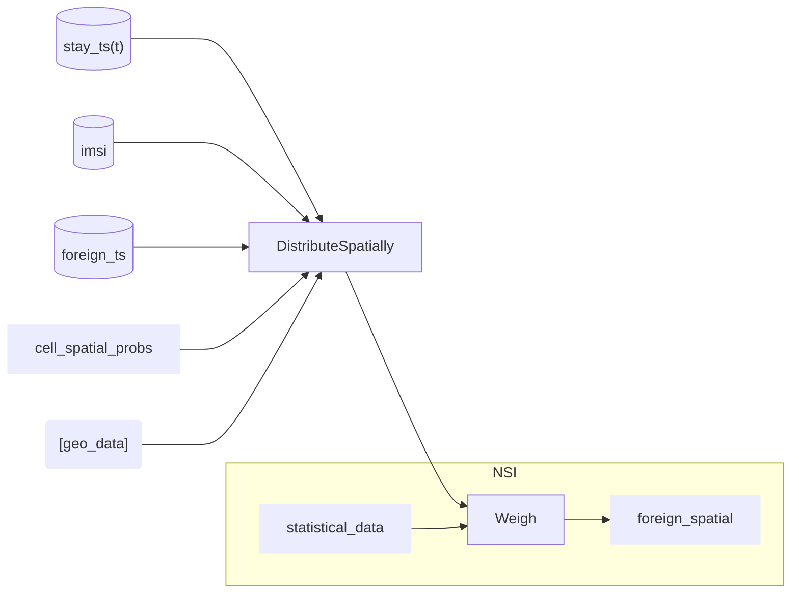

