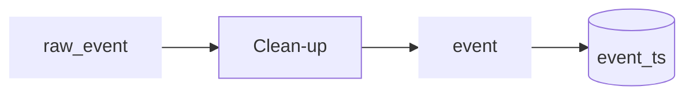

# Pipeline

## Events: Import and clean up high frequency events

Can also be roaming SMS



## Stays: Turn high frequency data/events into stays


```mermaid
flowchart LR
  event_ts[(event_ts)] --> Derive-stay --> Clean-up stay --> stays:::data --> stay_ts[(stay_ts)]
  clean_cell_plan --> Derive-stay

classDef data stroke-width:0px
```
