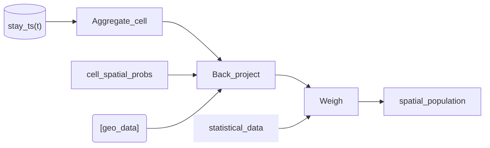

# Pipeline

## General

### Events: Import and clean up high frequency events

Can also be roaming SMS


### Stays: Turn high frequency data/events into stays


### Anchors

Classify stays and clean up stays into "meaning full" anchors (home/work etc.)


### Device classification
Roaming + Human/machine


## Other data

### Import cell plan

```mermaid
flowchart LR

cell_plan:::data --> CleanUp_cell --> clean_cell_plan:::data --> Mobloc -> cell_spatial_probs:::data

classDef data stroke-width:0px
```
An alternative for the last step would be to use data from the MNO such as best service maps to derive the `cell_spatial_probs`
```mermaid
flowchart LR

mno_signal:::data --> Rasterise -> cell_spatial_probs:::data

classDef data stroke-width:0px
```

### Import geodata

```mermaid
flowchart LR

geo_raw:::data --> Rasterise -> geo_data:::data

classDef data stroke-width:0px
```


## Use-Cases


### Use Case: Spatial current population





