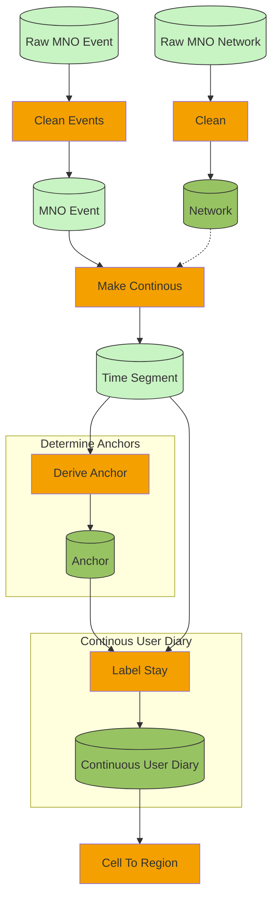
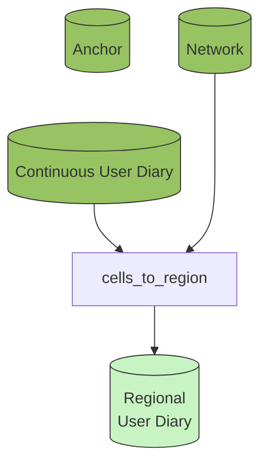

## Questions:

Concepts:
- Stay, continous user diary, anchor

Suggestion:

Stay (better name?)
- precursor to Continuous User Diary
- not continuous
- encodes stay at 1 cell_id 
- begin/end time
- input for Anchor and Continuous User Diary

Continuous User Diary
- encodes continuous user presence
- stay/move/unknown
- location? Suggestion: cell_id
- what to do with missing/tourist/new phones etc.?
- labeling with anchor probably is Use Case specific

Anchor:
- list of cell_ids
- needs a longer period of stays/events to analyze patterns
- would benefit from frequencies/stays fractions of the period

# Example Use Case

