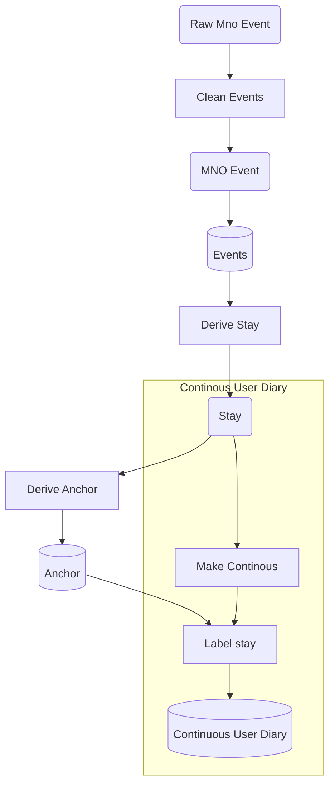

```mermaid
flowchart TD

rawevent:data("Raw Mno Event")
event:data("MNO Event")
stay("Stay")
event:db[("Events")]
anchor_db[("Anchor")]
cud_db[("Continuous User Diary")]

derive_stay["Derive Stay"]
make_cont["Make Continous"]
label["Label stay"]

rawevent:data --> CleanUp["Clean Events"] --> event:data
event:data --> event:db
event:db --> derive_stay --> stay

stay --> derive_achor["Derive Anchor"] --> anchor_db
anchor_db --> label

subgraph cud["Continous User Diary"]
stay --> make_cont --> label
label --> cud_db
end 
```
