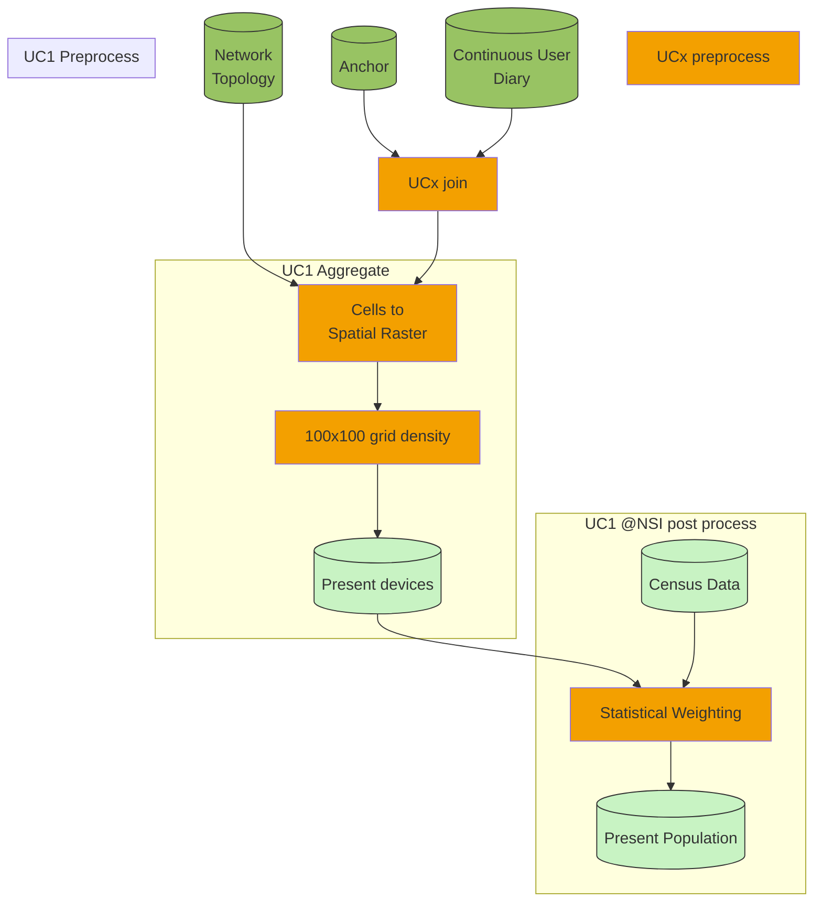

Use Case 1

```mermaid
flowchart TD

classDef data fill:#033d59,stroke-width:1px, color:#333333;
classDef process fill:#f3a000,stroke-width:1px,color:#333333;
classDef db fill:#c8f3c3,stroke:#333333,color:#333333;
classDef db_rest fill:#98c363,stroke:#333333,color:#333333;

DeviceDist[("Present devices")]:::db
Census[("Census Data")]:::db
RegionCud[("Present Population")]:::db

Network[("Network\nTopology")]:::db_rest
AnchorDB[("Anchor")]:::db_rest
CUDDB[("Continuous User\nDiary")]:::db_rest

usecase_preprocess["UCx preprocess"]:::process
join["UCx join"]:::process
cells_to_region["Cells to\n Spatial Raster"]:::process
weight["Statistical Weighting"]:::process
aggregate["100x100 grid density"]:::process

AnchorDB --> join
CUDDB --> join

subgraph UC1 Preprocess
end

Network ---> cells_to_region
join --> cells_to_region

subgraph UC1 Aggregate
  cells_to_region --> aggregate
  aggregate --> DeviceDist
end

DeviceDist --> weight
subgraph atnsi["UC1 @NSI post process"]
  Census --> weight
  weight --> RegionCud
end

```
